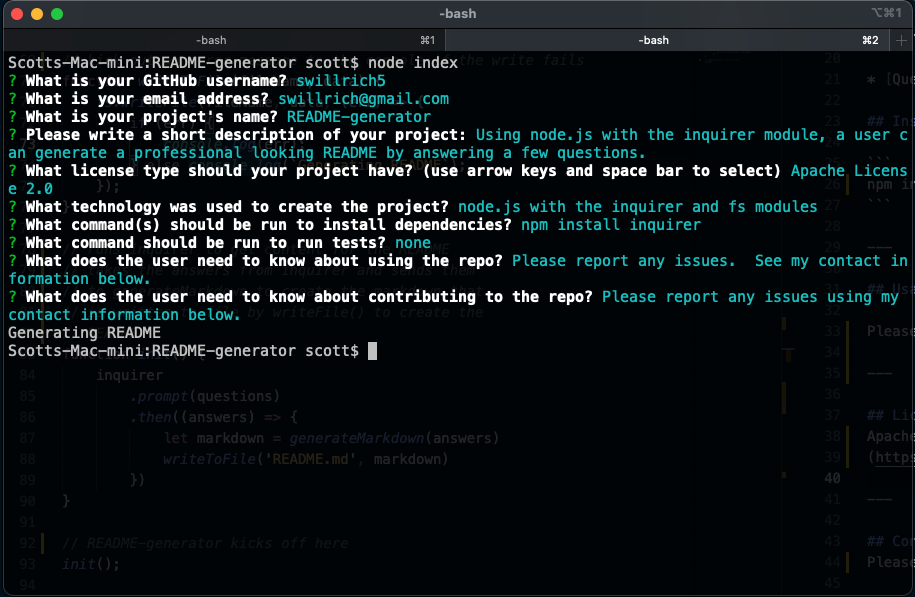

# README-generator

[](https://opensource.org/licenses/Apache-2.0)

---



Data Entry Screenshot


## Description

Using node.js with the inquirer module, a user can generate a professional looking README by answering a few questions.

---

## Table of Contents

* [Installation](#installation)

* [Usage](#usage)

* [License](#license)

* [Contributing](#Contributing)

* [Questions](#Questions)

## Installation

```
npm install inquirer
```

---

## Usage

The README created by the application can be edited for updates or to add additional information such as a screenshot. 

---

## License
Apache License 2.0
(https://opensource.org/licenses/Apache-2.0)

---

## Contributing
Please report any issues using my contact information below.

---

## Questions
GitHub Profile: https://github.com/swillrich5

Email Address: swillrich@gmail.com
